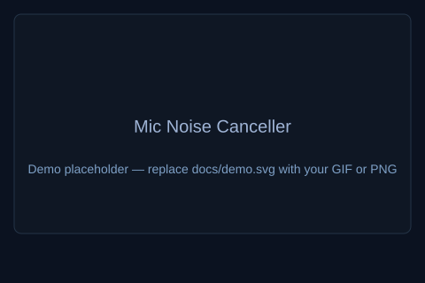

[](https://github.com/mohamedmoamen8/mic-noise-canceller/actions/workflows/build.yml)
[](https://github.com/mohamedmoamen8/mic-noise-canceller/actions/workflows/test.yml)
[](./LICENSE)

# Mic Noise Canceller

A lightweight Manifest V3 Chrome extension that applies real‑time microphone noise suppression entirely on the client. Audio processing runs inside an offscreen document using an AudioWorklet pipeline and (when available) a compiled RNNoise WASM engine — nothing is uploaded to a server and all audio stays local.




## Features

- RNNoise ML engine with automatic fallback to an adaptive JavaScript noise gate
- Microphone calibration: record ~3 seconds of ambient noise, review playback, and save a tuned profile
- Adjustable suppression strength (0–100%)
- Live frequency visualizer while noise reduction is active
- Monitor mode: optionally hear the cleaned signal through your speakers
- TypeScript codebase with unit tests and CI-friendly scripts

## Architecture (high level)

```
popup.html / popup.ts          ← UI (toggle, calibration, sliders)
        ↕ chrome.runtime messages
background.ts (service worker) ← lifecycle, offscreen document management, storage
        ↕
offscreen.ts                   ← getUserMedia, AudioContext, worklet wiring
        ↕
noise-processor.ts (worklet)   ← real-time DSP on the audio rendering thread
        ↕
RNNoiseEngine  |  GateEngine  ← pluggable NoiseSuppressionEngine interface
```

Components

- `background.ts` — Creates/closes the offscreen document, routes messages, and persists state
- `offscreen.ts` — Captures microphone input, runs the AudioWorklet chain, and provides visualizer data
- `noise-processor.ts` — Instantiates RNNoise (WASM) or falls back to the `GateEngine` JS implementation
- `core/calibration/` — Records ambient noise and computes a `NoiseProfile` used to suggest strength/floor
- `core/storage.ts` — Wrapper around `chrome.storage.local` for running state, calibration, and strength settings

## Requirements

- Google Chrome 109+ (or a Chromium-based browser that supports MV3 offscreen documents and `wasm-unsafe-eval` CSP for WASM)
- Node.js 20+ (for building from source)

## Quick start

### Install from source

```bash
git clone https://github.com/mohamedmoamen8/mic-noise-canceller.git
cd mic-noise-canceller
npm install
npm run build
```

### Load in Chrome

1. Open `chrome://extensions`
2. Enable **Developer mode**
3. Click **Load unpacked**
4. Select the `dist/` folder created by the build

### Development

```bash
npm run watch      # rebuild on file changes
npm run typecheck  # TypeScript strict check
npm test           # unit tests (Vitest)
npm run package    # run typecheck + tests + build + zip
```

The packaged extension zip is written to `mic-noise-canceller.zip`.

## Usage

1. Click the extension icon to open the popup.
2. (Optional) Run Microphone calibration — stay quiet for ~3 seconds, play back the clip to confirm it captured background noise only, then save the profile.
3. Toggle **Noise reduction** on. Chrome will prompt for microphone permission.
4. Adjust **Suppression strength** to taste.
5. Enable **Monitor cleaned audio** if you want to hear the processed signal locally.

The popup badge shows which engine initialized: **RNNoise (ML)** or **JS fallback**.

## Troubleshooting

- Permission prompt not shown: ensure the extension is loaded in `chrome://extensions` and that the extension has the `activeTab` and `microphone`-related permissions in the unpacked `manifest.json` during development. Reload the extension after changing the manifest.
- RNNoise (WASM) failed to initialize: check the extension CSP and `wasm-unsafe-eval` setting; open the background page console for WASM linker errors.
- No audio output in Monitor mode: confirm your audio output device and Chrome’s site audio settings; try disabling exclusive audio device usage in other apps.
- High CPU usage: RNNoise is optimized, but if you see consistently high CPU, try lowering the suppression strength or use the JS gate fallback.

If you still run into issues, open an issue with a short description, steps to reproduce, and Chrome console logs if available.

## Project structure

```
├── public/                  Static assets copied to dist/ (manifest, HTML)
├── scripts/
│   ├── build.mjs            esbuild bundler (IIFE per entry point)
│   └── zip.mjs              Packages dist/ into a Chrome-ready zip
├── src/
│   ├── core/
│   │   ├── calibration/     Noise profile analysis
│   │   ├── dsp/             RNNoise engine, gate fallback, ring buffer
│   │   ├── messages/        Typed runtime message contracts
│   │   └── storage.ts       chrome.storage.local helpers
│   └── entrypoints/
│       ├── background/      Service worker
│       ├── offscreen/       Audio capture + worklet host
│       ├── popup/           Extension popup UI
│       └── worklet/         AudioWorkletProcessor (RNNoise / gate)
├── test/                    Unit tests for DSP and calibration
└── dist/                    Build output (load this in Chrome)
```

## Scripts

| Command | Description |
|---------|-------------|
| `npm run build` | Bundle all entry points into `dist/` |
| `npm run watch` | Watch mode (no minification) |
| `npm run typecheck` | Strict TypeScript check |
| `npm test` | Run Vitest unit tests |
| `npm run package` | Full release pipeline + zip |
| `npm run clean` | Remove `dist/` |

## Privacy

- Microphone access is used only when you enable noise reduction or run calibration.
- Calibration audio is held briefly in memory as a temporary data URI for playback confirmation; only numeric profile values are persisted.
- No network requests are made. No analytics. No external services.

## Known limitations

- This extension processes audio inside the browser and does not replace the system microphone for other applications (Zoom, Discord, Google Meet, etc.). Other apps will still receive the raw system input.
- Chrome-only: relies on MV3 offscreen documents and extension CSP for WASM.
- RNNoise adds ~10 ms of algorithmic latency (typically imperceptible for voice chat).

---

If you'd like anything changed (different badge links, a real demo GIF, or a different license), tell me and I’ll update the branch.
